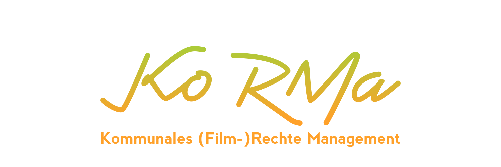

<h1></h1>

 

Das kommunale (Film-)Rechte Management ist eine Software, die kommunalen
Kinos die Suche nach aktuellen Rechteinhabern und Verleihen erleichtern soll.
Dieses Repository ist in zwei Teile aufgeteilt, einmal ein Frontend und ein
Backend, welche eng aneinander zusammen entwickelt werden.
Für weitere Informationen über den jeweiligen Teil, stehen getrennte READMEs
in den jeweiligen Ordnern zur Verfügung.

